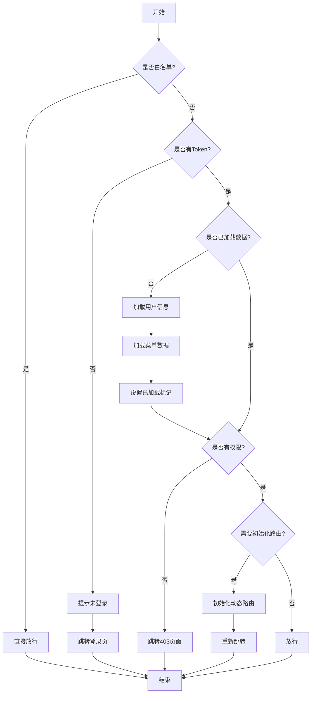

# 路由守卫适配文档

## 概述

本文档描述如何将 Origin 项目的路由守卫逻辑适配到 Pure-Admin 的路由系统中。

## Origin 路由守卫逻辑

### 核心流程

```typescript
router.beforeEach(async (to, from, next) => {
	// 1. 白名单检查（登录页、错误页）
	if (isWhiteList(to.name)) {
		next();
		return;
	}

	// 2. Token 检查
	const token = store.getToken;
	if (!token) {
		next({ name: "Login" });
		ElMessage.warning("在未登录时，禁止访问其他页面！");
		return;
	}

	// 3. 初始化数据加载
	if (!store.isLoaded) {
		await store.loadUser();
		await store.loadMenus();
		store.setLoaded(true);
	}

	// 4. 放行
	next();
});
```

### 关键特性

1. **白名单机制**: 登录页、404、403、500 页面无需验证
2. **Token 验证**: 未登录用户强制跳转登录页
3. **数据懒加载**: 首次访问时加载用户信息和菜单
4. **示例模块**: 开发环境下放行示例模块

## Pure-Admin 路由守卫逻辑

### 核心流程

```typescript
router.beforeEach((to, from, next) => {
	// 1. 缓存处理
	if (to.meta?.keepAlive) {
		handleAliveRoute(to, "add");
	}

	// 2. 页面标题设置
	setPageTitle(to);

	// 3. 登录状态检查
	if (hasUserInfo()) {
		// 3.1 权限检查
		if (to.meta?.roles && !hasRole(to.meta.roles)) {
			next({ path: "/error/403" });
			return;
		}

		// 3.2 动态路由初始化
		if (needInitRouter()) {
			initRouter().then(() => {
				router.push(to.fullPath);
			});
			return;
		}

		next();
	} else {
		// 4. 未登录处理
		if (isWhiteList(to.path)) {
			next();
		} else {
			removeToken();
			next({ path: "/login" });
		}
	}
});
```

### 关键特性

1. **路由缓存**: 支持 keepAlive 缓存
2. **权限验证**: 基于角色的页面级权限
3. **动态路由**: 支持动态路由加载
4. **多标签页**: 集成多标签页管理

## 适配方案

### 1. 保留 Pure-Admin 的核心功能

- ✅ 路由缓存（keepAlive）
- ✅ 页面标题设置
- ✅ 权限验证（roles）
- ✅ 多标签页管理

### 2. 集成 Origin 的登录验证逻辑

```typescript
// 在 Pure-Admin 的路由守卫中添加 Origin 的逻辑
router.beforeEach(async (to, from, next) => {
	// ... Pure-Admin 的缓存和标题处理 ...

	// Origin 兼容：白名单检查
	const whiteList = ["/login", "/error/404", "/error/403", "/error/500"];
	if (whiteList.includes(to.path)) {
		next();
		return;
	}

	// Origin 兼容：Token 检查
	const userStore = useUserStoreHook();
	const tokenData = getToken();

	if (!tokenData) {
		ElMessage.warning("在未登录时，禁止访问其他页面！");
		next({ path: "/login" });
		return;
	}

	// Origin 兼容：初始化数据加载
	if (!userStore.isLoaded) {
		try {
			await userStore.loadUser();
			await userStore.loadMenus();
			userStore.setLoaded(true);
		} catch (error) {
			console.error("加载用户数据失败:", error);
			removeToken();
			next({ path: "/login" });
			return;
		}
	}

	// Pure-Admin 的权限检查
	if (to.meta?.roles && !isOneOfArray(to.meta.roles, userStore.roles)) {
		next({ path: "/error/403" });
		return;
	}

	// ... Pure-Admin 的动态路由处理 ...

	next();
});
```

### 3. 统一错误处理

```typescript
// 统一的错误消息提示
function showAuthError(message: string) {
	ElMessage.warning(message);
}

// 统一的登录跳转
function redirectToLogin(next: NavigationGuardNext) {
	removeToken();
	next({ path: "/login" });
}
```

## 适配后的完整流程



## 关键代码实现

### 1. 扩展的路由守卫

```typescript
// main/src/router/index.ts

import { ElMessage } from "element-plus";
import { useUserStoreHook } from "@/store/modules/user";

router.beforeEach(async (to, from, next) => {
	// 1. 处理路由缓存（Pure-Admin）
	if (to.meta?.keepAlive) {
		handleAliveRoute(to, "add");
		if (from.name === undefined || from.name === "Redirect") {
			handleAliveRoute(to);
		}
	}

	// 2. 设置页面标题（Pure-Admin）
	NProgress.start();
	const externalLink = isUrl(to?.name as string);
	if (!externalLink) {
		to.matched.some((item) => {
			if (!item.meta.title) return "";
			const Title = getConfig().Title;
			if (Title) document.title = `${transformI18n(item.meta.title)} | ${Title}`;
			else document.title = transformI18n(item.meta.title);
		});
	}

	// 3. 白名单检查（Origin 兼容）
	const whiteList = ["/login", "/error/404", "/error/403", "/error/500"];
	if (whiteList.includes(to.path)) {
		next();
		return;
	}

	// 4. Token 检查（Origin 兼容）
	const userStore = useUserStoreHook();
	const tokenData = getToken();

	if (!tokenData) {
		ElMessage.warning("在未登录时，禁止访问其他页面！");
		removeToken();
		next({ path: "/login" });
		return;
	}

	// 5. 初始化数据加载（Origin 兼容）
	if (!userStore.isLoaded) {
		try {
			await userStore.loadUser();
			await userStore.loadMenus();
			userStore.setLoaded(true);
		} catch (error) {
			console.error("加载用户数据失败:", error);
			ElMessage.error("加载用户数据失败，请重新登录");
			removeToken();
			next({ path: "/login" });
			return;
		}
	}

	// 6. 权限检查（Pure-Admin）
	if (to.meta?.roles && !isOneOfArray(to.meta.roles, userStore.roles)) {
		next({ path: "/error/403" });
		return;
	}

	// 7. 动态路由初始化（Pure-Admin）
	if (usePermissionStoreHook().wholeMenus.length === 0 && to.path !== "/login") {
		// ... Pure-Admin 的动态路由逻辑 ...
	}

	// 8. 放行
	next();
});
```

### 2. 辅助函数

```typescript
/** 检查是否在白名单中 */
function isInWhiteList(path: string): boolean {
	const whiteList = ["/login", "/error/404", "/error/403", "/error/500"];
	return whiteList.includes(path);
}

/** 检查用户是否有指定角色 */
function hasRole(requiredRoles: string[], userRoles: string[]): boolean {
	return requiredRoles.some((role) => userRoles.includes(role));
}

/** 显示认证错误消息 */
function showAuthError(message: string) {
	ElMessage.warning(message);
}

/** 重定向到登录页 */
function redirectToLogin(next: NavigationGuardNext) {
	removeToken();
	next({ path: "/login" });
}
```

## 测试要点

### 1. 白名单测试

- ✅ 访问登录页无需验证
- ✅ 访问错误页无需验证

### 2. Token 验证测试

- ✅ 无 Token 时跳转登录页
- ✅ 有 Token 时正常访问

### 3. 数据加载测试

- ✅ 首次访问加载用户信息
- ✅ 首次访问加载菜单数据
- ✅ 加载失败跳转登录页

### 4. 权限验证测试

- ✅ 有权限正常访问
- ✅ 无权限跳转 403 页面

### 5. 路由缓存测试

- ✅ keepAlive 路由正确缓存
- ✅ 非 keepAlive 路由不缓存

## 注意事项

### 1. 异步加载

Origin 的数据加载是异步的，需要使用 `await` 等待加载完成。

### 2. 错误处理

加载用户数据失败时，应该清除 Token 并跳转登录页。

### 3. 性能优化

只在首次访问时加载数据，后续访问直接使用缓存。

### 4. 兼容性

保持 Pure-Admin 的所有功能，只添加 Origin 的逻辑，不删除 Pure-Admin 的代码。

## 迁移检查清单

- [x] 保留 Pure-Admin 的路由缓存功能
- [x] 保留 Pure-Admin 的页面标题设置
- [x] 保留 Pure-Admin 的权限验证
- [x] 保留 Pure-Admin 的动态路由
- [x] 添加 Origin 的白名单检查
- [x] 添加 Origin 的 Token 验证
- [x] 添加 Origin 的数据加载逻辑
- [x] 统一错误消息提示
- [x] 统一登录跳转逻辑
- [ ] 编写路由守卫测试
- [ ] 验证所有场景

## 参考资料

- [Vue Router 导航守卫](https://router.vuejs.org/zh/guide/advanced/navigation-guards.html)
- [Pure-Admin 路由配置](https://yiming_chang.gitee.io/pure-admin-doc/pages/routerMenu/)
